# CÁCH JAVA LƯU TRỮ DỮ LIỆU
## I. Cách Java lưu trữ dữ liệu:
### 1. Các loại bộ nhớ 
Trong module Run Time Area, có 2 vùng nhớ.
1. Bộ nhớ Heap: Là nơi lưu trữ đối tượng trong Java, nó được tạo trong Heap khi ta sử dụng từ khóa new để khởi tạo
2. Bộ nhớ Stack: Là nơi lưu trữ biến cục bộ và các tham số của phương thức. Mỗi lần một phương thức được gọi, 1 frame mới được tạo ra trên Stack để lưu trữ biến cục bộ và tham số của phương thức đó. Khi chương trình hoàn thành,frame được loại bỏ khỏi Stack.
    - > Frame: Là 1 đơn vị dữ liệu được tạo ra khi 1 phương thức được gọi trong chương trình Java, nó chữa thông tin về biến cục bộ, phương thức, giá trị trả về
    - > (Tương tự như 1 cái hộp đựng các thông tin về biến,...) rồi chồng lên bộ nhớ Stack.

### 2. Cách lưu trữ bộ nhớ trên Heap và Stack khác nhau: 
- Trong Heap, bộ nhớ đc cấp phát động khi có đt mới được tạo ra,và sẽ giải phóng khi không có tham chiếu đến đối tượng đó nữa.  
- Trong Stack, bộ nhớ đc cấp phát tĩnh khi 1 phương thức được gọi, và bộ nhớ sẽ giải phóng khi phương thức hoàn thành.  
  
VD:

```java
public class EX{
     private static int publicX1 = 1;
     private int X2 = 2;
     public static void main(String[] args){
        int localX3 = 3;
        Object obj = new Object();
        System.out.println(obj);
     }
}
```
- Trong VD: 
    - publicX1 lưu trong Heap (static memory)
    - X2 lưu trong Heap (non-static memory, lưu trữ các biến thuộc lớp) ????
    - Tham số args lưu trữ trên stack vì là biến cục bộ
       - Biến cục bộ localX3: được lưu trữ trên stack vì nó cũng là 1 biến cục bộ của phương thức.
       - Đối tượng obj : khởi tạo bằng new, **
       ***lưu trữ trên heap***, còn ***đia chỉ tham chiếu lưu trữ trên stack***
       - Frame được tạo ra khi main được khởi tạo.
       - Sau khi main kết thúc, frame trên stack bị loại bỏ. Còn đt trên bộ nhớ heap vấn tồn tại đến khi bị bộ thu gom rác dọn.
### 3. Lớp wrapper: Cung cấp cho ta 1 cách sử dụng kdl nguyên thủy là kdt tham chiếu.
1 số kiến thức về wrap:
1. KDL nguyên thủy và lớp Wrapper tương ứng:
   
| Primitive Data | Wrapper Class |
| ------------- | ------------- |
| char | Character |
| byte | Byte |
| short | Short |
| int | Integer |
| long | Long |
| float | Float |
| double | Double |
| boolean | Boolean |
         
2. Cách chuyển:  
   1. Được gọi là quá trình **Boxing**    
       1. C1: Sử dụng từ khóa new + KDL Wrapper():(Nhưng , nó báo lỗi ở Integer, có nghĩa là có thể sau này sẽ bị bỏ đi, =>  SD cách khác)
        Code: 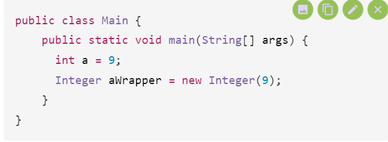
       2. C2: sử dụng valueOf()
        Code: 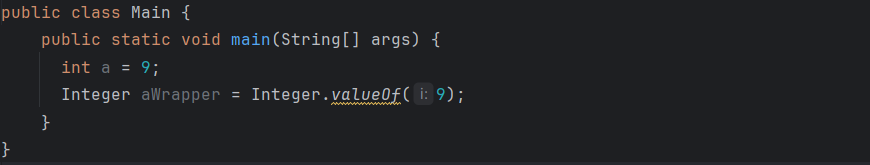

   2. **Autoboxing** :Khi gán thẳng 1 giá trị cho 1 ĐT, java sẽ tự động đóng hộp cho mình.
    - Lưu ý: Autoboxing sẽ chỉ nhận giá trị nguyên thủy
    Code : 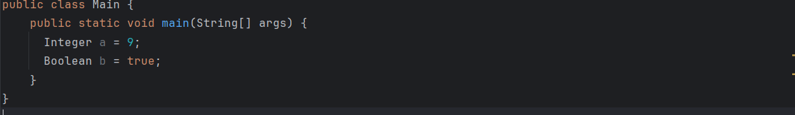
   3. **Unboxing**, **AutoUnboxing**: tương tự trên và ngược lại.
3. Các lưu ý:
    1. KDL Wrapper chạy chậm hơn kdt nguyên thủy (do lại phải mò đến địa chỉ => giá trị....).
     => Nên cân nhắc
    2. String KO PHẢI là Wrapper Class do Wrap bao lấy 1 giá trị ng thủy duy nhất. Nhưng String lại bao lấy 1 mảng, không phải 1 giá trị nguyên thủy duy nhất 
4. Lợi ích:
    1. Chuyển đổi dữ liệu nguyên thủy thành đối tượng. Đối tượng cần thiết cho việc sửa đổi các tham số được truyền vào qua phương thức.
    2. Lớp trong package java.util chỉ xử lý các đối tượng và lớp Wrapper giúp ích cho việc đó.
    3. Các cấu trúc dữ liệu như String, Array,HashCode... chỉ lưu trữ ở dạng đối tượng, chứ không phải dl nguyên thủy.
    4. ? 1 đối tượng cần được support đa luồng. 
    5. Đối tượng có thể sử dụng các phương thức như : compareTo(), equals(), toString(), ...
    6. Đối tượng cho phép giá trị NULL. // Quan trọng
5. Cách lưu trữ bộ nhớ :
    1. Khi SD **Boxing**: Khi sử dụng lớp Wrapper như Integer, Float hay Boolean, đối tượng Wrapper được tạo ra và lưu trữ trên bộ nhớ heap. Điều này có nghĩa là giá trị của biến được đóng gói trong một đối tượng Wrapper, và đối tượng này được quản lý bởi garbage collector.
    2. Khi SD **AutoBoxing**:
    Khi sử dụng autoboxing =>  lớp Wrapper tương ứng (ví dụ: int sang Integer), Java sẽ tự động tạo một đối tượng Wrapper và lưu trữ nó trong bộ nhớ heap. Điều này giúp bạn có thể sử dụng các phương thức và tính năng của lớp Wrapper.
    3. Khi SD **Unboxing**: 
    Khi sử dụng autounboxing, một đối tượng Wrapper => kiểu nguyên thủy tương ứng (ví dụ: Integer sang int), Java sẽ tự động trích xuất giá trị của đối tượng Wrapper và lưu trữ nó trong bộ nhớ stack như một biến kiểu nguyên thủy.
### 4. Phương thức khởi tạo (Constructor).
1. **Constructor**: Là 1 phương thức đặc biệt để khởi tạo đối tượng.
   Nếu coi đối tượng là 1 ngôi nhà thì Class là bản thiết kế, còn Constructor là thợ xây.
VD:
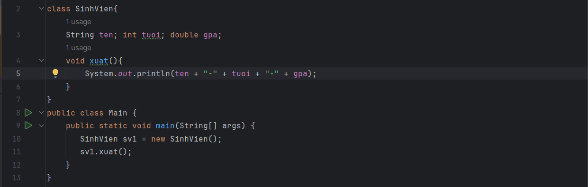
Xuất: 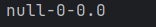

   1. new SinhVien() là gì? : 
        - SinhVien() cũng là 1 phương thức trong Class SinhVien và nó gọi là phương thức mặc định(default construction) , xuất hiện tự động trong Class, cùng tên với Class.
          - 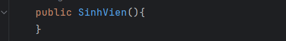
        - Dấu () sử dụng khi gọi phương thức => SinhVien() cũng được gọi là phương thức.
        - Đặc biệt: chỉ có chỉ định truy cập, ko có kiểu trả về.
   2. Thân constructor, ta có thể cài đặt cho các thuộc tính:
   VD: 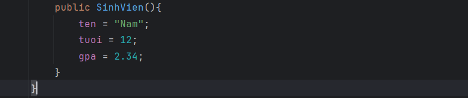 
   Thì cùng với Code như ở VD 1, ta sẽ có kết quả sau: 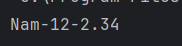
    => Mặc định sẽ truyền giá trị như trên cho Object.
   3. Truyền giá trị trong Constructor: 
    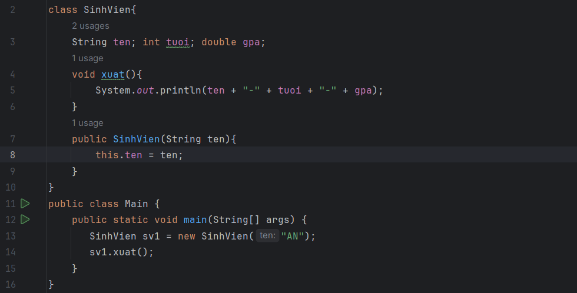
    Xuất: 
   4. **Lưu ý khi sử dụng Cóntructor**
      1. Không sử dụng Default Constructor khi đã có những Constructor khác. Nếu muốn sử dụng, thì phải khai báo 
      2. 1 lớp có thể có nhiều Constructor. Và phải thỏa mãn các điều kiện:
         1. Các Constructor trong lớp phải có kiểu dl, tham số.
         2. **Số lượng tham số phải khác nhau**.
            VD :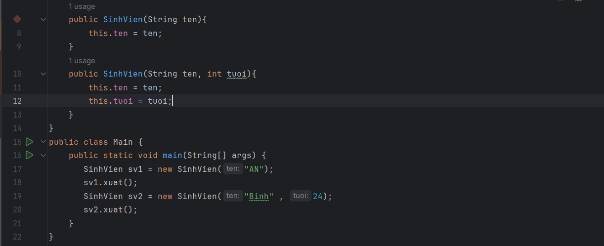
            Xuất: 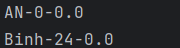
            => Nó sẽ sử dụng các Constructor có cùng dạng, số lượng với các tham số truyền vào.
2. Super :

Trong java, từ khóa super có 3 cách sử dụng như sau:

    1. Từ khóa super được sử dụng để tham chiếu trực tiếp đến biến instance của lớp cha gần nhất.
    2. super() được sử dụng để gọi trực tiếp Constructor của lớp cha.
    3. Từ khóa super được sử dụng để gọi trực tiếp phương thức của lớp cha.
   VD:
   

### 5. Garbage Collector trong Java.
1. ĐN: Trong Java, rác (garbage) có nghĩa là 1 đối tượng không được tham chiếu nữa và bộ thu gom rác (Garbage collector) có nhiệm vụ hủy các đối tượng đó để giải phóng bộ nhớ. 
2. Hoạt động :
   1. Java đã cung cấp một bộ Garbage Collector sẽ tự động dọn dẹp bộ nhớ. Nhờ nó, các developer sẽ không cần quan tâm đến việc quản lý và phân phối lại bộ nhớ của chương trình như C/C++.
   2. Garbage Collectors (dưới đây sẽ gọi tắt là GC) được định nghĩa như là một quá trình **tự động thực thi nhiệm vụ quản lý bộ nhớ**. Code Java được dịch sang bytecode rồi chạy trên máy ảo Java hay viết tắt là JVM. Trong quá trình chạy chương trình, *các đối tượng được tạo ở **vùng nhớ heap***, một phần bộ nhớ dành cho chương trình. Sau cùng, sẽ có một vài đối tượng mà chương trình không cần dùng đến. Các đối tượng này sẽ được *garbage collector truy tìm và xóa bỏ* để thu hồi lại dung lượng bộ nhớ. 
   3. Trong bộ nhớ Heap, các Object ko cần sẽ bị loại bỏ để giải phóng bộ nhớ.
   4. Có nhiều tiến trình thu gom rác khác nhau nhưng phổ biến nhất Oracle HotSpot. Mặc dù HotSpot có nhiều tiến trình thu gom rác được tối ưu cho từng trường hợp khác nhau nhưng tất cả đều theo một phương thức cơ bản nhất
      -  Đầu tiên, các Object không được tham chiếu sẽ được đánh dấu sẵn sàng để được dọn rác.
      -  Ở bước thứ hai, trình thu gom rác sẽ tiến hành xóa các Object đó.
      -  Ở bước thứ ba, vùng nhớ của các Object còn lại sẽ được nén lại và nằm liền kề nhau trong bộ nhớ Heap. Quá trình này sẽ giúp việc cấp phát bộ nhớ cho Object mới dễ dàng hơn.
      -  Ở vùng nhớ Heap được chia làm 3 vùng nhớ nhỏ hơn, tạm gọi là Young generation, Old generation và Permanent generation.
          - Young generation: được chia thành nhiều vùng nhớ nhỏ hơn là Eden(khởi tạo) và Survivor(sống sót). Các Object vừa được khởi tạo sẽ nằm ở vùng Eden, sau chu kì quét đầu tiên nếu Object đó còn tồn tại thì sẽ được chuyển sang vùng Survivor. Tại đây cái Object được GC theo dõi liên tục, nếu  như qua nhiều chu kì quét mà Object vẫn còn được sử dụng thì lúc này Object sẽ được chuyển sang vùng nhớ thứ thứ hai.
          - Old generation: là nơi chứa những Object tòn tại đủ "lâu", còn "lâu" như thế nào thì lại tùy thuộc vào thuật toán của từng bộ GC.
          - Permanent generation: không chứa Object mà đây là nơi để chứa các metadata của JVM như các class và method của ứng dụng. Do đó nếu các class và method không còn được sử dụng nữa thì GC sẽ coi chúng là "rác" và dọn dẹp nó.
### 6. Pass by Value và Pass by Reference trong Java
1. Truyền tham trị là việc ta tạo ra một bản sao của bản gốc, thay đổi bản sao thì không làm ảnh hưởng đến bản gốc.
   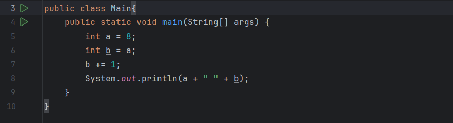
   xuất: 
