# Buổi 4: MỌI THỨ ĐỀU LÀ ĐỐI TƯỢNG
## 1. Tính đóng gói:
1. Định nghĩa: 
    - Là trạng thái của đối tượng được bảo vệ không cho các truy cập từ code bên ngoài như thay đổi trong thái hay nhìn trực tiếp. 
    - Việc cho phép môi trường bên ngoài tác động lên các dữ liệu nội tại của một đối tượng theo cách nào là hoàn toàn tùy thuộc vào người viết mã. 
    - Đảm bảo sự toàn vẹn, bảo mật của đối tượng Trong Java, tính đóng gói được thể hiện thông qua phạm vi truy cập (access modifier). Ngoài ra, các lớp liên quan đến nhau có thể được gom chung lại thành package.
2. VD: 
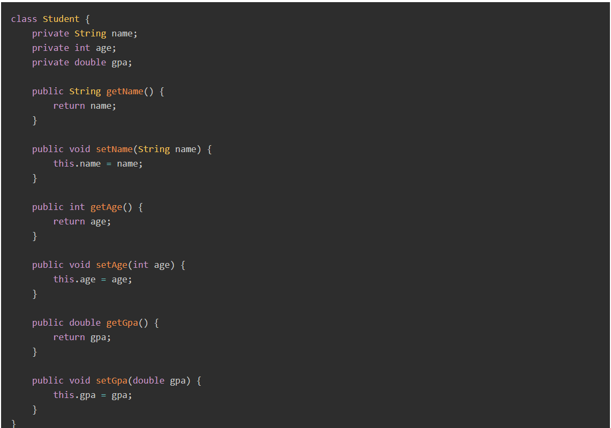
    - Nếu ta sử dụng các biến:name ,... là *public*, ta có thể truy cập vào qua rất nhiều cách khác nhau. Vậy chương trình sẽ có rất nhiều lỗ hổng. Vậy nên, ta nên sử dụng biến có phạm vi *private* và truy cập thông qua Getter và Setter. 
3. Lợi ích:
    - **Hạn chế được các truy xuất không hợp lệ tới các thuộc tính của đối tượng.**
    - Giúp cho trạng thái của các đối tượng luôn đúng.
    - Giúp ẩn đi những thông tin không cần thiết về đối tượng.
    - Cho phép bạn thay đổi cấu trúc bên trong lớp mà không ảnh hưởng tới lớp khác. 
    - **Áp đặt được các quy tắc về truy cập và thay đổi.**
## 2. TÍNH KẾ THỪA:
1. Định nghĩa: 
    - Là khả năng cho phép ta xây dựng một lớp mới dựa trên các định nghĩa của một lớp đã có. 
    - Lớp đã có gọi là lớp cơ sở (Base Class) hoặc lớp cha (Parent Class) , lớp mới phát sinh gọi là dẫn xuất (Derived Class) hay lớp Con (Subclass) và kế thừa tất cả các thành phần của lớp Cha, có thể chia sẻ hay mở rộng các đặc tính sẵn có mà không phải tiến hành định nghĩa lại.
2. VD:
- Ta cần tạo 1 list lưu thông tin của Sinh Viên và Giáo Viên, 2 Class này có nhứng thuộc tính giống và cũng có khác nhau.
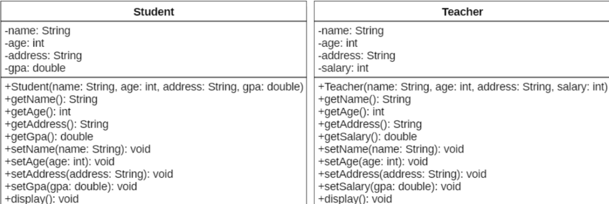
- Vậy nếu ta tạo cả 2 Class có những thuộc tính trên sẽ bị trùng lặp rất nhiều thuộc tính và vi phạm nguyên tắc DRY (Don't Repeat Yourself - đừng bao giờ lặp lại code). Kế thừa trong OOP sẽ giúp bạn giải quyết vấn đề này.
- Ta tạo 1 Class Person(cha) chứa những thuộc tính giống nhau của cả 2 và Class Student cà Teacher là con của Person, chứa các thuộc tính riêng biệt và kế thừa những thuộc tính giống nhau thừ cha:
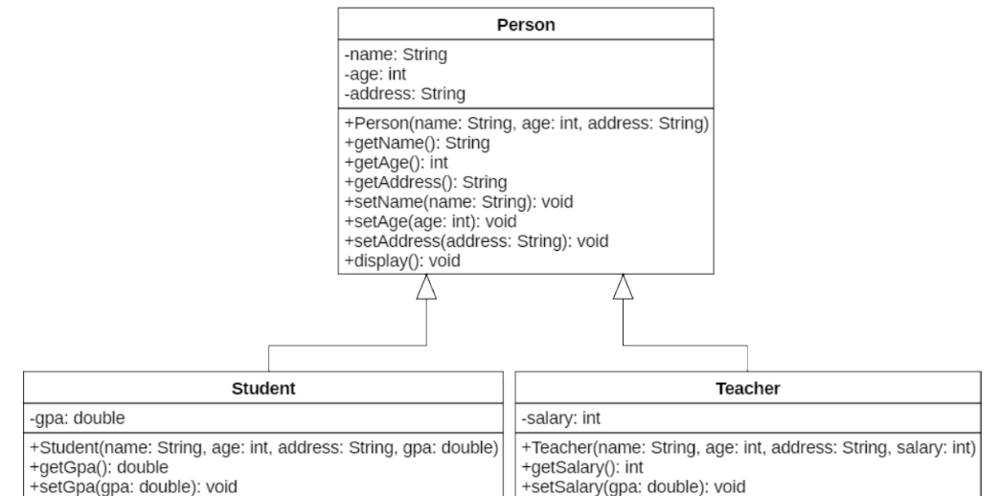
- Code:
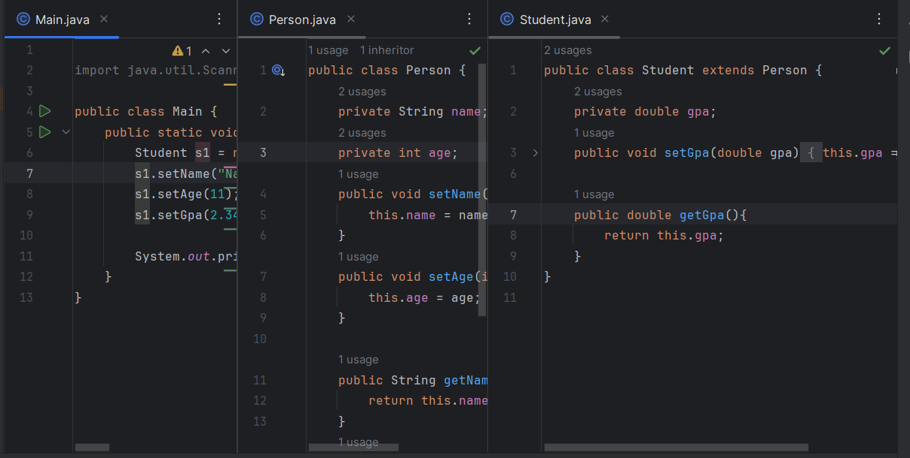
Xuất :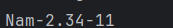
3. Các đặc điểm:
    1. Các lớp con không thừa hưởng thuộc tính private của lớp cha (Không sử dụng thuộc tính private của Class Cha ở trong phần code của Class Con):
    - VD 1: age để private :
    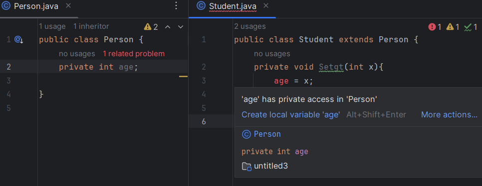 
    - VD 2: age để public:
    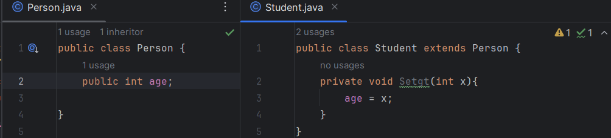
    2. Các Constructor của lớp Con luôn gọi tới Constructor cảu lớp Cha, nếu không chỉ rõ thì sẽ mặc định gọi tới Default Constructor:
    VD: 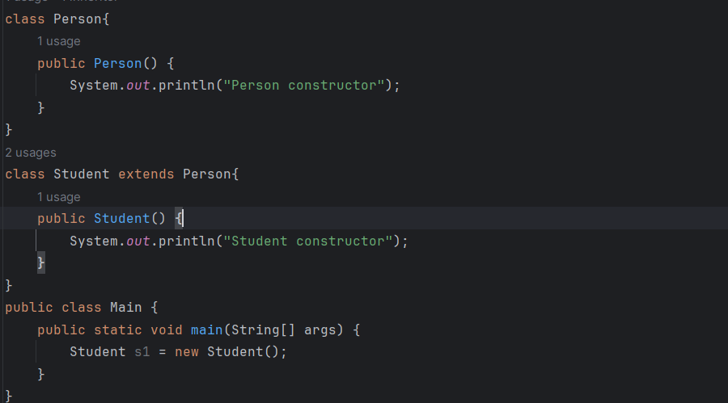
    Xuất: 
    - Vì lý do đó, Nếu Class Cha mà không có Default Constructor thì phải chỉ ra trong Class Con, nếu không sẽ có lỗi như sau:
    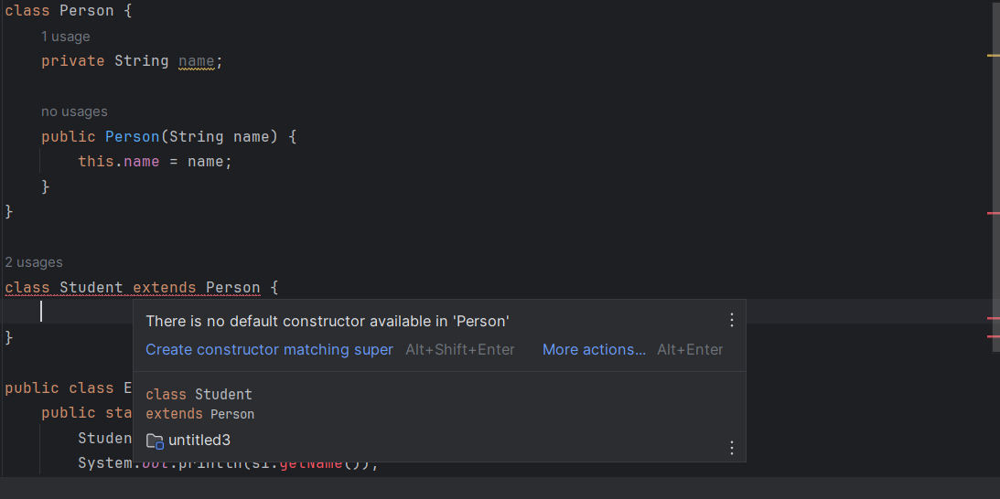
    - Cách sửa lỗi: Sử dụng từ khóa Super để gọi tới Constructor có tham số của Class cha
    VD :
    ```java
    class Person {
        private String name;

        public Person(String name) {
            this.name = name;
        }
        public String getName(){
            return this.name;
        }
    }

    class Student extends Person {
        public Student(String name){
            super(name);
        }
    }

    public class Main {
        public static void main(String[] args) {
            Student s1 = new Student("Nam");
            System.out.println(s1.getName());
        }
    }
    ```
    - Kết quả : Nam
4. Các lưu ý: 
- Java không hỗ trợ đa kế thừa (VD: lớp C kế thừa 1 phương thức từ 2 lớp cha A, B).

5. Ghi đè phương thức trong Java:
VD: 
```java
class SuperClass{
	public void display() {
		System.out.println("Hello from SuperClass");
	}
}

class SubClass extends SuperClass{
	@Override
	public void display() {
		System.out.println("Hello from SubClass");
	}
}

class Entry {
	public static void main(String[] args) {
		SubClass s = new SubClass();
		s.display();
	}
}
```
Xuất: 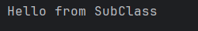
- Trong ví dụ, ta có thể thấy phương thức display() của lớp cha đã bị ghi đè 
- **@Override** là một annotation để chú thích rằng display() là một phương thức ghi đè phương thức từ lớp cha. Việc sử dụng @Override annotation là không bắt buộc nhưng trong mọi trường hợp bạn nên dùng nó vì các lợi ích sau:
    - Nếu một phương thức được chú thích với annotation @Override thì chương trình sẽ kiểm tra xem phương thức này có thực sự ghi đè phương thức của lớp cha không, nếu không thì sẽ báo lỗi. (Sử dụng để tránh những lối gõ nhầm hoặc trùng tên, ...)
    - Giúp người khác khi nhìn vào code sẽ hiểu được đây là phương thức được ghi đè từ lớp cha.
    - Nếu lớp cha bị ghi đè mà vẫn muốn sử dụng: Xài từ khóa "super"
    VD: 
    ```java
    class SuperClass{
    public void display() {
        System.out.println("Hello from SuperClass");
    }
    }
    class SubClass extends SuperClass{

        @Override
        public void display() {
            super.display();
            System.out.println("Hello from SubClass");
        }
    }

    class Entry {
        public static void main(String[] args) {
            SubClass s = new SubClass();
            s.display();
        }
    }
    ```
    Xuất :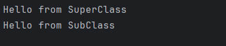
- Lưu ý:
    - Phương thức static không thể bị ghi đè.
    - Phương thức non-static nếu không muốn lớp con ghi đè thì có thể sử dụng từ khóa "final"
    - Phạm vi truy cập của Con phải > Cha:

        - Quy tắc: private -> default -> protected -> public

        - Nếu làm ngược lại chương trình sẽ báo lỗi:
        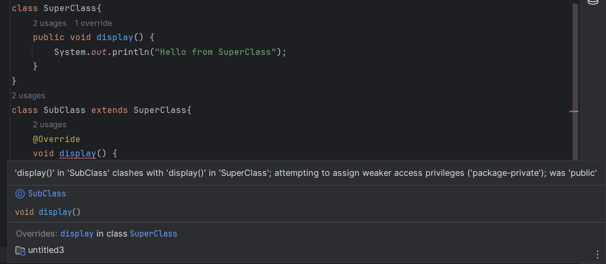
6. Các kiểu kế thừa trong Java:
- Trong Java, có 3 kiểu kế thừa: 
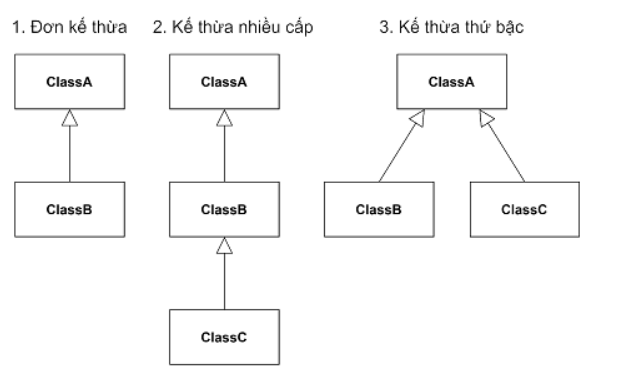
- Trên thực tế, mọi lớp đều được đơn kế thừa từ lớp Object, Nhưng nếu ta cho 1 lớp kế thừa từ 1 lớp khác thì nó là kế thừa nhiều cấp bậc.
7. Up-casting và down-casting trong Java
VD:
```java
class Animal {
    public void sound() {
        System.out.println("some sound");
    }
}

class Cat extends Animal {
    public void sound() {
        System.out.println("nyan nyan");
    }
}

class Dog extends Animal {
    public void sound() {
        System.out.println("woof woof");
    }
}

public class Main {
    public static void main(String[] args) {
        // Up-casting
        Animal animal1 = new Cat();
        animal1.sound();
        // Up-casting
        Animal animal2 = new Dog();
        animal2.sound();
    }
}
```
Trong ví dụ trên:  
- Upcasting là Khai báo Object của Con theo kiểu dữ liệu của lớp cha.
- Khi biến của lớp cha tham chiếu tới đối tượng của lớp con thì biến này chỉ có thể gọi tới các thuộc tính và phương thức có ở lớp cha và nếu lớp con ghi đè thì phương thức được gọi sẽ ở lớp con. 
    -  Nếu sử dụng phương thức của lớp con khi Upcasting thì chương trình sẽ báo lỗi, VD:
    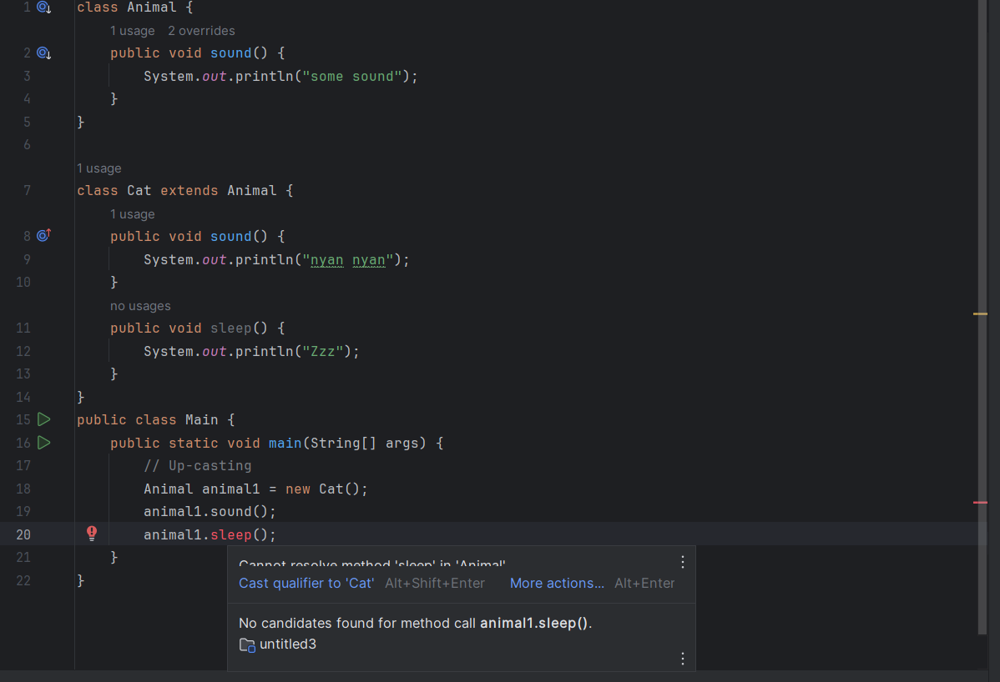
    - Nhưng nếu sử dụng sound()(của Class Cha) thì hoạt động được :
    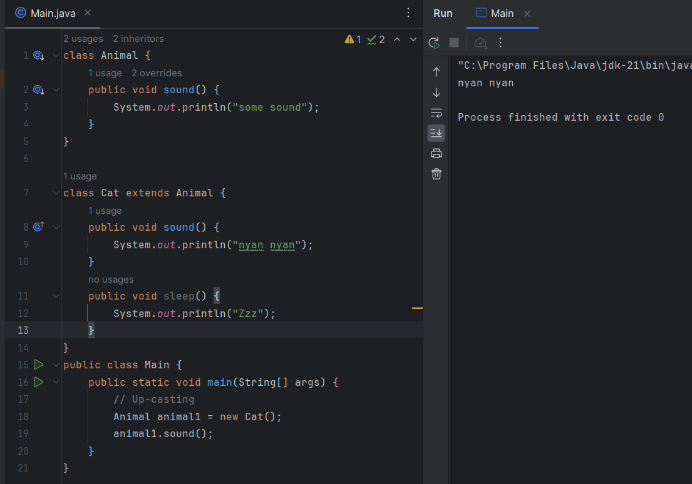
- Downcasting ngược lại với Upcasting.
- Variable Hiding:
    - Variable Hiding xảy ra khi lớp con khai báo thuộc tính có tên giống tên thuộc tính ở lớp cha, lúc này thuộc tính của lớp cha sẽ không bị lớp con ghi đè mà bị lớp con ẩn đi:
    ```java
    class SuperClass{
        int x = 10;
    }

    class SubClass extends SuperClass{
        int x = 20;
    }

    public class Entry {
        public static void main(String[] args) {
            SuperClass a = new SubClass();
            System.out.println(a.x);
        }
    }
    ```
    - Trong VD  trên: do x là thuộc tính độc lập, nên khi sử dụng up-casting với kdl Cha thì sẽ gọi thuộc tính của lớp cha.
    - Nếu muốn sử dụng x của lớp Con thì phải sử dụng downcasting:
        ```java
        class SuperClass{
            int x = 10;
        }

        class SubClass extends SuperClass{
            int x = 20;
        }

        public class Entry {
            public static void main(String[] args) {
                SuperClass a = new SubClass();
                System.out.println(a.x);
                System.out.println(((SubClass)a).x);
            }
        }
        ```
    Xuất: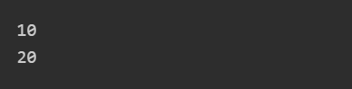
## 3. Tính đa hình:
1. Định nghĩa : Polymorphism là từ được cấu thành từ 2 từ Hy Lạp là poly và morhps, nếu hiểu theo nghĩa tiếng anh thì từ này có nghĩa là *one thing in many form* , nghe thì có vẻ khó hiểu nhưng nếu nhìn vào các ví dụ bên dưới thì bạn sẽ hình dung ra được thế nào là one thing in many form. Tính đa hình được thể hiện trong code dưới 3 hình thức: nạp chồng phương thức, ghi đè phương thức và đa hình thông qua các đối tượng đa hình (polymorphic objects).

2. Đa hình với nạp chồng phương thức : 

    VD: phương thức cộng sẽ có các "forms" là cộng 2 số nguyên, cộng 2 số thực, cộng 3 số nguyên, v/v. Có thể thấy cùng là phương thức cộng nhưng lại có nhiều "forms" (one thing in many form) nên đây chính là biểu hiện của tính đa hình. Ví dụ về đa hình với nạp chồng phương thức:
    1. Đa hình với nạp chồng phương thức:

    ```java
    class Calculator {
        public int add(int a, int b) {
            return a + b;
        }

        public double add(double a, double b) {
            return a + b;
        }

        public int add(int a, int b, int c) {
            return a + b + c;
        }
    }

    public class Entry {
        public static void main(String[] args) {
            Calculator calculator = new Calculator();
            System.out.println(calculator.add(1, 2));
            System.out.println(calculator.add(3.3, 4.2));
            System.out.println(calculator.add(1, 2, 3));
        }
    }
    ```
    Xuất :
    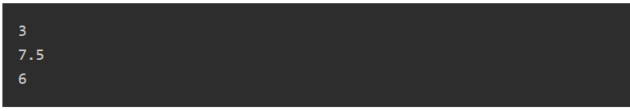

    2. Đa hình với ghi đè phương thức:

    ```java
    class Employee {
        private String name;
        private int salary;

        public Employee(String name, int salary) {
            super();
            this.name = name;
            this.salary = salary;
        }

        public String getName() {
            return name;
        }

        public void setName(String name) {
            this.name = name;
        }

        public int getSalary() {
            return salary;
        }

        public void setSalary(int salary) {
            this.salary = salary;
        }

        public void display() {
            System.out.println("Name: " + getName());
            System.out.println("Salary: " + getSalary());
        }
    }

    class Manager extends Employee {
        private int bonus;

        public Manager(String name, int salary, int bonus) {
            super(name, salary);
            this.bonus = bonus;
        }

        public int getBonus() {
            return bonus;
        }

        public void setBonus(int bonus) {
            this.bonus = bonus;
        }

        @Override
        public int getSalary() {
            return super.getSalary() + bonus;
        }
    }
    ```
    => getSalary tính lương cho cả nhân viên và quản lý, tuy nhiên, với mỗi vị trí lại có cách tính khác nhau.

    3. Đa hình thông qua các đối tượng đa hình (polymorphic objects)

    - Biến thuộc lớp cha có thể tham chiếu tới đối tượng của các lớp con, vậy biến thuộc lớp cha cũng có nhiều "forms" nên đây cũng là đa hình. Ví dụ:

    ```java
    class Animal {
        public void sound() {
            System.out.println("some sound");
        }
    }
    
    class Dog extends Animal {
        public void sound() {
            System.out.println("bow wow");
        }
    }
    
    class Cat extends Animal {
        public void sound() {
            System.out.println("meow meow");
        }
    }
    
    class Duck extends Animal {
        public void sound() {
            System.out.println("quack quack");
        }
    }

    public class Entry {
        public static void main(String[] args) {
            Animal animal = new Animal();
            animal.sound();
            animal = new Dog();
            animal.sound();
            animal = new Duck();
            animal.sound();
            animal = new Cat();
            animal.sound();
        }
    }
    ​```
Xuất: 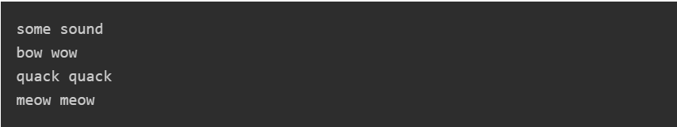
    - Có thể thấy trong ví dụ trên, biến animal có thể đại diện cho các đối tượng của các lớp Animal, Cat, Dog. Đây cũng là một ví dụ điển hình của tính đa hình.

> **Nguồn tham khảo: Codelearn**

***
***
# Buổi 3:
## 1. Tính đóng gói:
1. Getter, Setter: 
- Tác dụng:
    - Chỉ bảo mật hơn 1 chút.
    - Tạo ra 2 luồng sử dụng biến.
    - Quản lý dữ liệu đầu vào (VD: Độ tuổi trong giới hạn,...)
2. Tính đóng gói không chỉ dùng ở Get,Setter: 
- Khi viết chương trình, chia thành nhiều hàm nhỏ, giúp ta quan tâm đến các thứ ngoài, bên trong thì đóng gói lại, cần thì sd.
3. Khả năng tái sử dụng:
## 2. Tính kế thừa: 
- Ko nên sd kế thừa trong haser
- Lợi: Khi có 1 tính năng cũ, không sd nữa, ta nên phát triển từ 1 cái cũ trong cái mới, ta nên sd kế thừa, những cái nào hd bthg thì oke
- Hại:
  - Phức tạp, khó quản lý với lượng data lớn.
1. Java Không hỗ trợ Đa kế thừa:
   VD : Đa kế thừa C++: Phân chức vị trong gia đình (VD: 1 ng vừa là bố vừa là con)
## 3. Tính đa hình:
1. Khác nhau ComplieTime và RunTime:
2. Tác dụng của DownCasting, UpCasting:
   - Tại sao phải sd khi có thể gọi trực tiếp :
     - Vd: Sở thú có 100 loài, tạo 1 list theo kdl Animal, nếu cần kêu thì ép kiểu gọi đến thì dễ xử lý hơn.
        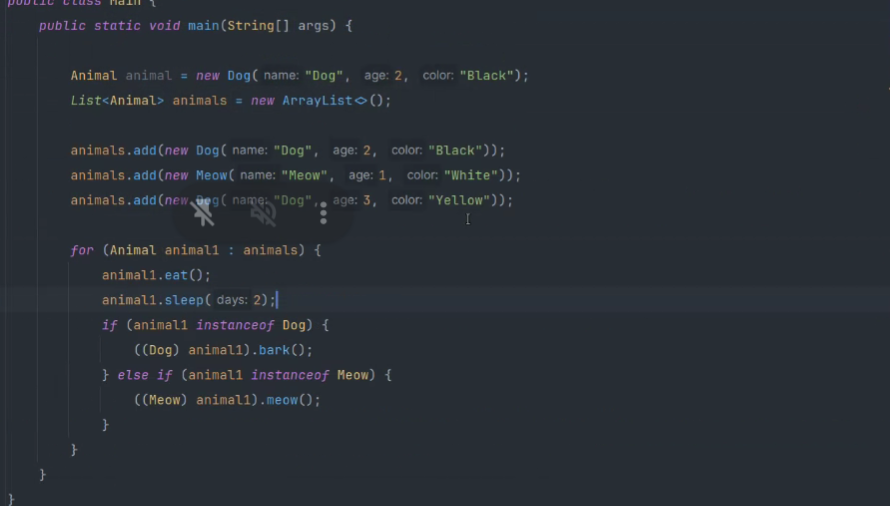

       **instanceof** : kiểm tra là loài nào (tạo đc khi = new LoàiVat() )
